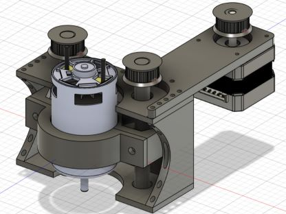

 

# Open-Router-Project
A mostly 3D printed CNC Router + Firmware (for any arduino microcontroller) that I designed and developed myself!

## What is it?
Open-Router is a Cheap, open-source CNC Router that I designed and developed over the past month. I wrote some easy to use arduino firmware with a serial gcode interpreter (in theory, is compatible with most software for streaming gcode) that you can use alongside this machine, or most other CNC machines! I'm working on expanding support for even more gcode commands! I only started properly working on this project less than 3 weeks ago, so haven't been able to fulfill the herculean task of getting it fully operational just yet. It should be ready within a few weeks I'm expecting!

I started this project as a massive side project, when I wanted to work on some other larger projects at home (an electric motorbike), but soon realised that in order to be able to cut metal components to the precision I wanted, I would need some kind of CNC machine. All of the existing packages I found were too expensive, and massive overkill for what I needed, so I set out to make my own system! I went through more than 6 designs, with the final 3 looking similar to the one I settled with finally. This final version uses a ganged Y axis, and is built on a stable frame made of aluminium extrusion and held square with linear rails. These, along with the use of leadscrews, help to make sure that I can get high precision parts without expensive calibration tools. It uses bog-standard NEMA 17 motors since they were very cheap off of Aliexpress (and are widely compatible with a lot of stepper drivers) while also being sufficiently high quality for my application (they are used in eighth step mode for this, but this can be changed to alter the speed or precision). I used GT2 timing belts for driving the Z-axis since its ubiquitously used in the 3D printing world and i had some spare from a printer modification. 

Because of some oversights early in the development, and my not wanting to spend more money, the router has a smaller than 300 by 300mm cutting area, being around 280 by 240mm, with 60mm of Z-travel. This is more than enough for my application, but can easily be expanded by changing some extrusion lengths

Even though the router was made for a specific purpose, I only wrote the firmware just because I wanted to - there are plenty of other available software packages that you could set up with this system (I.E. using GRBL with an Arduino, or the Genmitsu GRBL control board would reduce a lot of the effort and cut the price down by over £20). Alas, I really wanted to experience writing some lower-level code. My next step for this project is going to be creating a custom control board with an STM32 chip and integrated drivers and ESCs, but that'll take me quite a long time (because of university applications and schoolwork...) 

## How expensive is it
One of my biggest goals while making this was to keep the cost low while retaining functionality, and I would definitely say that I achieved this. It's quite cheap, especially compared to off-the-shelf solutions!
  
Sub-£200!!
It can come out to being a lot cheaper given the ubiquity of most of these parts, and my overestimating of filament used (I used just over a kilogram for 3 full prototypes!)

## Setup instructions
Follow assembly as shown in the full CAD model, available under the CAD folder. I've also provided pictures from every orthogonal direction, so it should be simple to assemble with those two resources combined. 

## Functionality
I haven't managed to test this yet, due to lead times on some parts, but I am expecting to be able to cut aluminium and possibly thin steel with this! MDF and Plywood should definitely be cuttable with this system. 

## Previous Versions
Here are some images of the previous CAD iterations I went through before settling on this design, from most to least recent! The first image was actually the one I was going to make, but that was while I was holding out hope that a belt would miraculously be suitable for this application. After making it halfway through the project I had a reality check and stopped praying for a miracle, and replaced the mechanism with a £3 leadscrew off of Amazon (which worked flawlessly). 

  

